# Block Stacker

A VEX V5 robot built for the block-stacking challenge. It runs a fully autonomous routine at the start of each match — navigating to a block using a distance sensor, clamping it with a motorized claw, lifting it with a dual-motor arm, and placing it on the stack — then hands control off to the driver via a VEX controller.

## Hardware

| System     | Components                            |
| ---------- | ------------------------------------- |
| Drive      | 4× V5 motors (tank drive, 18:1 ratio) |
| Arm        | 2× V5 motors (dual-motor lift)        |
| Claw       | 2× V5 motors                          |
| Sensors    | Distance sensor (block detection)     |
| Controller | VEX V5 Brain + wireless controller    |

## Software

The robot runs two phases sequentially:

1. **Autonomous** — executes a hard-coded sequence: raise arm, turn, drive toward block until the distance sensor reads ≤10 cm, close claw, lift, reverse, turn, drive to stack, lower and release.
2. **Driver control** — left joystick (Axis 2) drives the right side, right joystick (Axis 3) drives the left side; R1/R2 raise and lower the arm; L1/L2 open and close the claw.

## Build

Requires the [VEX VS Code extension](https://marketplace.visualstudio.com/items?itemName=VEXRobotics.vexcode) or the VEXcode toolchain.

```bash
make
```

## Gallery

<table>
<tr>
<td>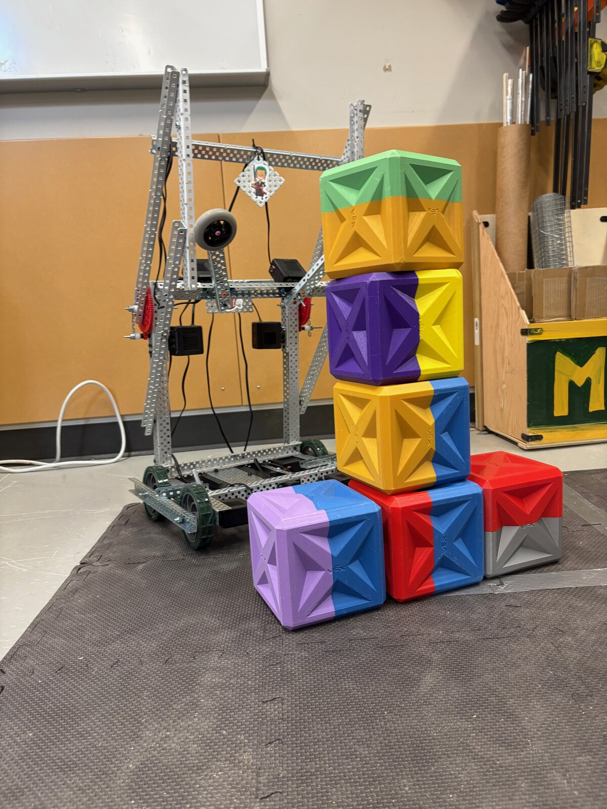</td>
<td>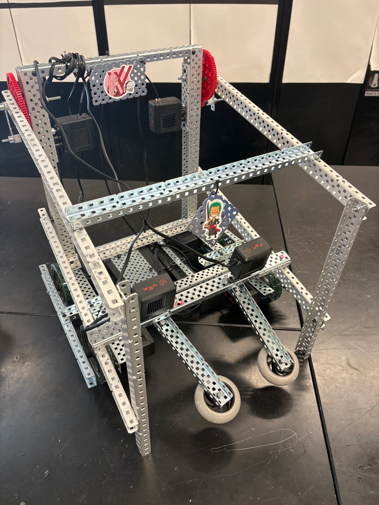</td>
<td>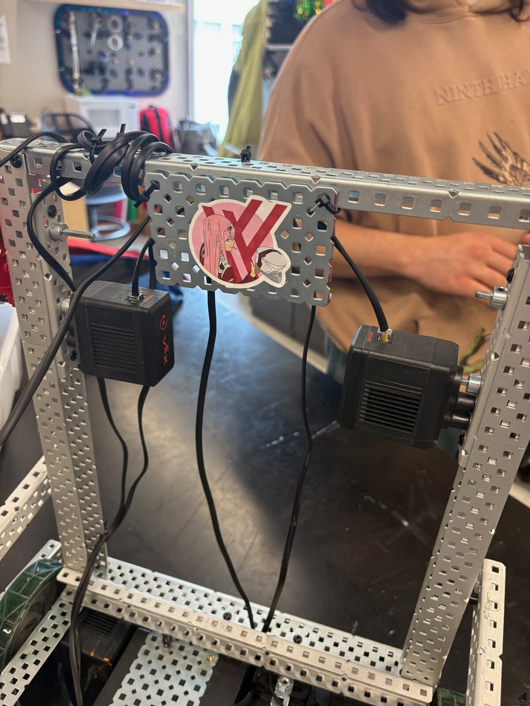</td>
</tr>
<tr>
<td>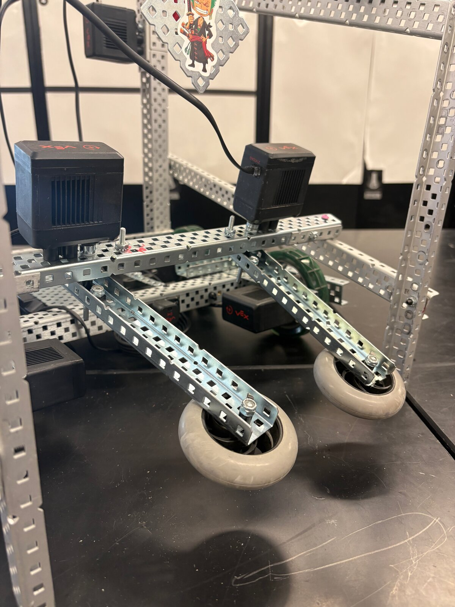</td>
<td>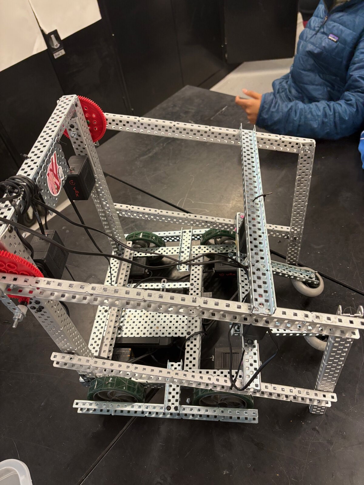</td>
<td>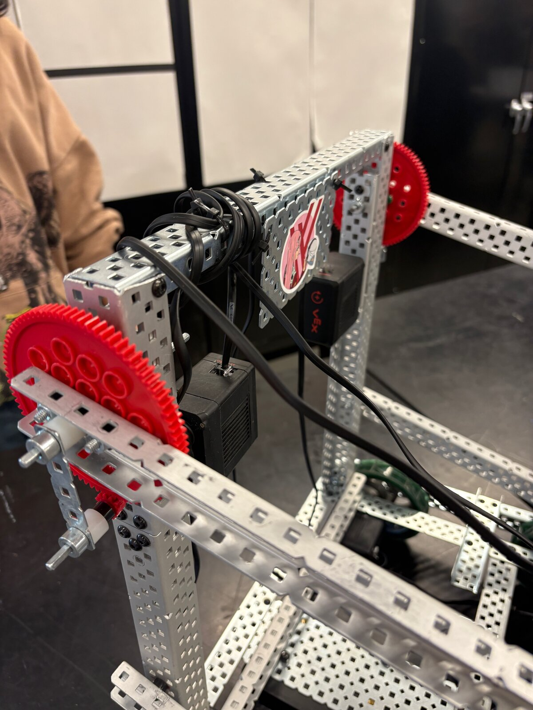</td>
</tr>
<tr>
<td>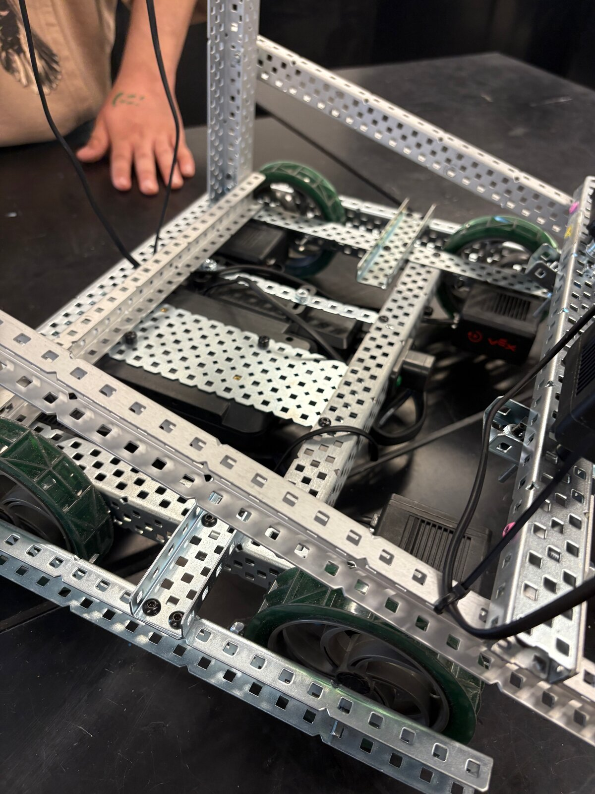</td>
<td>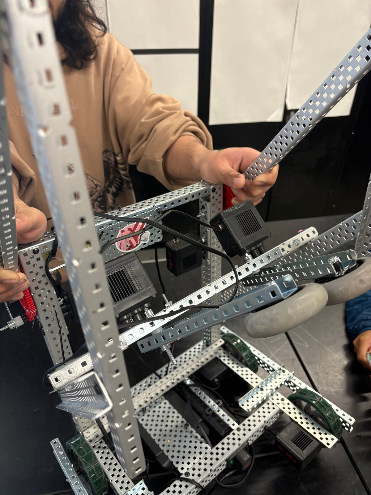</td>
<td>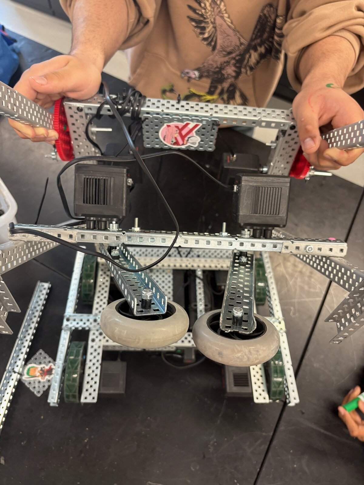</td>
</tr>
<tr>
<td>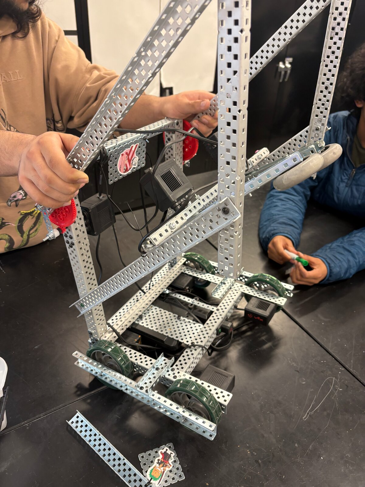</td>
<td>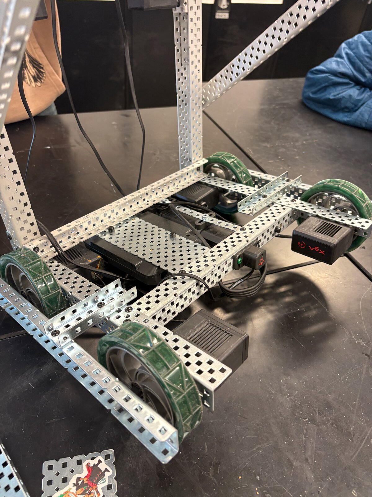</td>
<td></td>
</tr>
</table>
