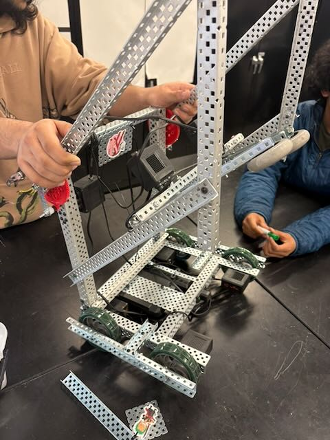

# Block Stacker (VEX V5)

A **VEX V5** robot program written in C++ developed for the **Redmond High School** _Principles of Engineering_ course.
Enables block stacking with both autonomous routines and manual control.
Features integrated driving, turning, arm, and claw mechanisms—operable via controller or pre-programmed sequences.

## Features

- 🚗 **Drive system**

  - Four-motor tank drive (front/back, left/right).
  - Distance sensor support for automatic stopping.

- 🦾 **Arm control**

  - Dual motors for lifting.
  - Button mappings for raise/lower with hold braking.

- 🤲 **Claw control**

  - Dual motors for opening/closing.
  - Button mappings for grab/release with hold braking.

- 🤖 **Autonomous routine**

  - Lifts arm, turns, drives forward/backward, and grabs a block.
  - Uses distance sensor to approach target.
  - Places the block after navigating.

- 🎮 **Manual control**
  - Tank drive mapped to joysticks:
    - Axis2 → left side
    - Axis3 → right side
  - Arm mapped to **R1 (up)** and **R2 (down)**
  - Claw mapped to **L1 (close)** and **L2 (open)**

## 📜 Code Structure

- `driveForwardUntilDistance(targetDistance)`
  Drives forward until the distance sensor detects an object closer than the target distance.

- `drive(seconds, forwards)`
  Drives forward or backward for a specified duration.

- `turn(angle)`
  Rotates robot by spinning left and right motors in opposite directions.

- `remoteControll()`
  Handles manual driving and arm/claw control via controller.

- `automatic()`
  Predefined sequence for picking up and stacking a block.

- `main()`
  Initializes system, runs the autonomous routine, then starts manual control loop.

## Hardware Mapping

- **Drive Motors**

  - Left Front: Port 1
  - Left Back: Port 2
  - Right Front: Port 11 (reversed)
  - Right Back: Port 12 (reversed)

- **Arm Motors**

  - Left Arm: Port 14
  - Right Arm: Port 15 (reversed)

- **Claw Motors**

  - Left Claw: Port 10
  - Right Claw: Port 9

- **Sensors**

  - Distance Sensor: Port 8

- **Controller**
  - Primary remote control

## Usage

1. Deploy to VEX V5 Brain via VEXcode or compatible toolchain
2. On startup, the robot:
   - Runs the **autonomous** sequence once
   - Switches to **manual control** for driver operation

> [!WARNING]
> The autonomous routine runs first. Ensure the area around the robot is clear before running to avoid accidents!

## Images 📸

These are some images of the robot our group wrote this program for:

> [!NOTE]
> These images are low quality to increase the speed of loading them on Github. Look [here](./assets/hi-res/) or **click the image** for the high resolution versions.

    
    

    
    

    
    

    
    

    
    

